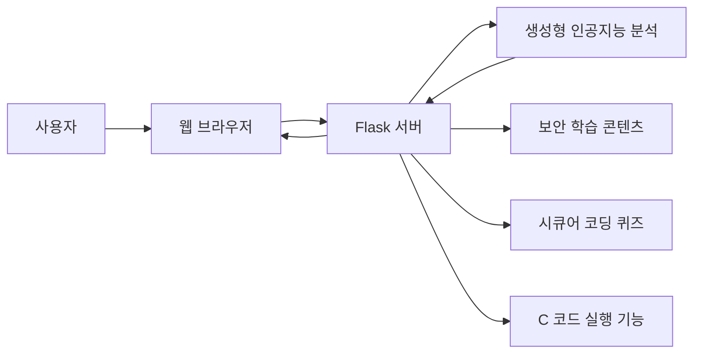
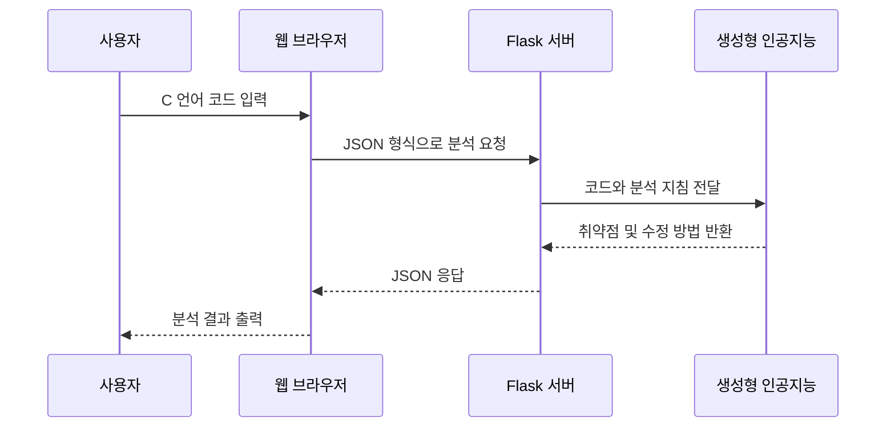

# SecureGPT

> **생성형 인공지능을 활용한 C 언어 시큐어 코딩 학습 및 코드 분석 웹 서비스**

SecureGPT는 사용자가 입력한 C 언어 코드를 분석하여 잠재적인 보안 취약점을 안내하고, 안전한 코드 작성 방법과 보안 지식을 학습할 수 있도록 제작한 웹 기반 교육 서비스입니다.

<p align="center">
  
</p>

---

## 프로젝트 개요

| 구분 | 내용 |
|---|---|
| 프로젝트명 | SecureGPT |
| 개발 형태 | 4인 팀 프로젝트 |
| 개발 분야 | 웹 개발, 생성형 인공지능, 소프트웨어 보안 교육 |
| 주요 언어 | Python, HTML, CSS, JavaScript |
| 웹 프레임워크 | Flask |
| 분석 대상 | C 언어 소스 코드 |
| 담당 역할 | 팀장, 서비스 기획, 웹 기능 개발 |
| 팀원 | 백주원, 김다솔, 김석준, 이상완 |

---

## 프로젝트 소개

소프트웨어 보안 취약점은 개발 초기 단계에서 발견하고 수정할수록 유지보수 비용과 위험을 줄일 수 있습니다.

SecureGPT는 사용자가 C 언어 코드를 입력하면 코드에서 발생할 가능성이 있는 보안 취약점을 분석하고, 해당 문제를 개선하기 위한 시큐어 코딩 방법을 안내하는 것을 목표로 제작했습니다.

또한 코드 분석 기능뿐만 아니라 다음과 같은 학습 기능을 함께 제공하여 사용자가 보안 개념을 단계적으로 이해할 수 있도록 구성했습니다.

- C 언어 코드 보안 취약점 분석
- 취약점 개선 방법 안내
- 시큐어 코딩 관련 보안 상식 제공
- 보안 취약점 퀴즈
- 취약한 코드와 안전한 코드 비교
- C 언어 코드 실행 기능

---

## 개발 배경

시큐어 코딩은 소프트웨어를 개발할 때 발생할 수 있는 보안 취약점을 사전에 제거하여 안전한 코드를 작성하는 개발 방법입니다.

프로젝트에서는 다음 문제에 집중했습니다.

- 올바르지 않은 메모리 접근
- 외부 입력값에 대한 검증 부족
- 오류 상황에 대한 처리 부족
- 취약한 함수 사용
- 잘못된 자원 관리
- 정수형 오버플로우
- 메모리 버퍼 오버플로우
- 포맷 문자열 취약점

발표자료에서는 C 언어 코드를 입력하면 발생 가능한 보안 취약점을 분석하고, 발견된 취약점을 기반으로 안전한 코드로 수정하는 서비스를 주요 기능으로 제시했습니다. :contentReference[oaicite:2]{index=2}

---

## 주요 기능

### 코드 검사기

사용자가 C 언어 코드를 입력하면 생성형 인공지능 기반 분석 결과를 화면에 출력합니다.

```text
C 언어 코드 입력
        ↓
서버에 분석 요청 전송
        ↓
보안 취약점 분석
        ↓
취약점 설명 및 개선 코드 반환
```

<p align="center">
  
</p>

#### 분석 대상 예시

- 정수형 오버플로우
- 메모리 버퍼 오버플로우
- 포맷 스트링 삽입
- NULL 포인터 역참조
- 초기화되지 않은 변수 사용
- 취약한 응용 프로그램 인터페이스 사용
- 잘못된 파일 권한 설정
- 종료되지 않는 반복문과 재귀함수
- 부적절한 예외 처리
- 자원 해제 누락

---

### 보안 상식

C 언어 프로그램에서 자주 발생하는 보안 취약점을 설명하는 학습 페이지입니다.

<p align="center">
  
</p>

#### 제공하는 보안 개념

- 정수형 오버플로우
- 메모리 버퍼 오버플로우
- 포맷 스트링 삽입
- 중요한 자원에 대한 잘못된 권한 설정
- 종료되지 않는 반복문 또는 재귀함수
- 오류 상황에 대한 대응 부재
- 부적절한 예외 처리
- NULL 포인터 역참조
- 부적절한 자원 해제
- 해제된 자원 사용
- 초기화되지 않은 변수 사용
- 취약한 함수 사용

---

### 시큐어 코딩 퀴즈

보안 상식 페이지에서 학습한 내용을 문제로 확인할 수 있습니다.

<p align="center">
  
</p>

각 문항은 하나의 정답을 선택하는 방식으로 구현했습니다.

```javascript
function submitQuiz(quizId, correctAnswers) {
    const checkboxes =
        document.querySelectorAll(
            `#${quizId} input[type="checkbox"]:checked`
        );

    const selectedValues =
        Array.from(checkboxes).map(cb => cb.value);

    if (selectedValues.length !== 1) {
        alert("1개의 항목을 선택해야 합니다.");
        return;
    }

    const isCorrect =
        selectedValues.every(
            value => correctAnswers.includes(value)
        );

    if (isCorrect) {
        alert("정답입니다!");
    } else {
        alert("틀렸습니다. 다시 시도해 보세요.");
    }
}
```

---

### 코드 가이드

취약한 코드와 개선된 코드를 비교하여 시큐어 코딩 방법을 확인할 수 있습니다.

제공된 코드 가이드에는 정수형 오버플로우, 버퍼 오버플로우, 포맷 문자열 취약점, NULL 포인터 역참조 등의 예시가 포함되어 있습니다. :contentReference[oaicite:3]{index=3}

<p align="center">
  
</p>

#### 코드 비교 예시

**취약한 코드**

```c
#include <stdio.h>

int main(void)
{
    char input[20];

    gets(input);

    printf("%s\n", input);

    return 0;
}
```

**개선된 코드**

```c
#include <stdio.h>
#include <string.h>

int main(void)
{
    char input[20];

    fgets(input, sizeof(input), stdin);
    input[strcspn(input, "\n")] = '\0';

    printf("%s\n", input);

    return 0;
}
```

---

### 코드 실행 페이지

사용자가 작성한 C 언어 코드를 입력하고 실행 결과를 확인할 수 있도록 별도의 코드 실행 페이지를 구성했습니다.

> 현재 제공된 Flask 코드에는 페이지 이동 경로만 포함되어 있으며, 실제 컴파일과 실행 처리 부분은 저장소 구성에 따라 추가 구현이 필요합니다.

---

## 화면 구성

| 주소 | 기능 |
|---|---|
| `/` | C 언어 코드 검사기 |
| `/guide` | 보안 상식 |
| `/quiz` | 시큐어 코딩 퀴즈 |
| `/code_runner` | C 언어 코드 실행 페이지 |

---

## 시스템 구조



---

## 코드 분석 처리 과정



---

## Flask 경로 구성

```python
from flask import Flask, render_template

app = Flask(__name__)


@app.route("/")
def home():
    return render_template("index.html")


@app.route("/guide")
def guide():
    return render_template("Guide.html")


@app.route("/quiz")
def quiz():
    return render_template("Quiz.html")


@app.route("/code_runner")
def code_runner():
    return render_template("CodeRunner.html")


if __name__ == "__main__":
    app.run(
        debug=True,
        host="0.0.0.0"
    )
```

---

## 사용 기술

### 백엔드

- Python
- Flask
- 생성형 인공지능 응용 프로그램 인터페이스
- JSON 요청 및 응답 처리
- 외부 프로세스 실행
- 임시 파일 처리

### 프론트엔드

- HTML
- CSS
- JavaScript
- Fetch API
- 반응형 화면 구성

### 개발 도구

- Visual Studio Code
- Flask 개발 서버
- Git
- GitHub

---

## 저장소 구조

```text
.
├── README.md
├── app.py
├── requirements.txt
├── templates
│   ├── index.html
│   ├── Guide.html
│   ├── Quiz.html
│   └── CodeRunner.html
├── static
│   ├── css
│   │   └── style.css
│   └── js
│       └── main.js
└── docs
    ├── 해커톤.pdf
    └── images
        ├── securegpt-main.png
        ├── code-checker.png
        ├── security-guide.png
        ├── security-quiz.png
        └── code-guide.png
```

---

## 실행 방법

### 저장소 복제

```bash
git clone 저장소주소
cd SecureGPT
```

### 가상환경 생성

```bash
python -m venv venv
```

### 가상환경 실행

#### Windows

```bash
venv\Scripts\activate
```

#### Linux 또는 macOS

```bash
source venv/bin/activate
```

### 패키지 설치

```bash
pip install flask
```

또는 다음 명령어를 사용합니다.

```bash
pip install -r requirements.txt
```

### 서버 실행

```bash
python app.py
```

브라우저에서 다음 주소로 접속합니다.

```text
http://127.0.0.1:5000
```

---

## requirements.txt

```text
Flask
```

생성형 인공지능 분석 기능을 다시 연결할 경우 사용하는 응용 프로그램 인터페이스 라이브러리를 추가해야 합니다.

---

## 구현 결과

- Flask 기반 다중 페이지 웹 서비스 구현
- C 언어 코드 입력 화면 구현
- 생성형 인공지능 기반 코드 분석 구조 설계
- 보안 취약점 설명 페이지 구현
- 시큐어 코딩 퀴즈 구현
- 취약한 코드와 개선 코드 비교 자료 구성
- 코드 실행 페이지 경로 구성
- 반응형 웹 화면 구현

---

## 담당 역할

### 백주원

- 프로젝트 팀장
- 프로젝트 주제 선정 및 서비스 기획
- 웹사이트 구조 설계
- Flask 서버 구성
- 코드 검사기 기능 구현 참여
- 보안 상식 및 시큐어 코딩 콘텐츠 구성
- 발표자료 제작 및 프로젝트 발표

---

## 기술적 회고

### 잘된 점

- 생성형 인공지능과 소프트웨어 보안 교육을 결합했습니다.
- 단순한 코드 분석을 넘어 보안 상식과 퀴즈 기능을 함께 구성했습니다.
- Flask의 경로 기능을 이용하여 여러 학습 화면을 분리했습니다.
- C 언어의 대표적인 보안 취약점을 코드 예시와 함께 제공했습니다.
- 취약한 코드와 개선된 코드를 비교하여 학습할 수 있도록 구성했습니다.

### 개선할 점

- 생성형 인공지능 응용 프로그램 인터페이스 호출 코드를 별도 모듈로 분리
- 비밀키를 환경 변수로 관리
- 응답 형식을 구조화된 JSON으로 통일
- 입력 코드 길이와 요청 횟수 제한
- 코드 분석 결과에 취약점 심각도 추가
- 취약점이 발생한 줄 번호 표시
- 코드 실행 기능을 격리된 환경에서 운영
- 컴파일 시간과 실행 시간 제한
- 파일 접근 및 시스템 명령어 제한
- 퀴즈 문항을 별도 JSON 파일로 관리
- 여러 개 선택이 불가능하도록 체크박스 대신 라디오 버튼 사용
- 공통 CSS와 JavaScript 파일 분리
- 중복된 HTML 메뉴를 기본 템플릿으로 통합
- 자동화된 테스트 코드 작성

---

## 보안 주의사항

사용자가 입력한 C 언어 코드를 서버에서 직접 컴파일하고 실행하는 기능은 매우 위험할 수 있습니다.

실제 서비스로 확장할 경우 다음과 같은 보호 조치가 필요합니다.

- Docker와 같은 격리 환경에서 코드 실행
- 네트워크 접근 차단
- 파일 시스템 접근 제한
- 실행 시간 제한
- 메모리와 CPU 사용량 제한
- 위험한 시스템 호출 차단
- 사용자 입력 검증
- 비밀키와 환경 변수 보호
- 실행 후 임시 파일 즉시 삭제

생성형 인공지능 응용 프로그램 인터페이스 키는 소스 코드에 직접 작성하지 않고 환경 변수로 관리해야 합니다.

```text
AI_API_KEY=YOUR_API_KEY
```

---

## 프로젝트를 통해 얻은 경험

- Python Flask 웹 서버 개발
- HTML, CSS, JavaScript 기반 화면 구현
- 프론트엔드와 백엔드 간 JSON 통신
- 생성형 인공지능 기반 코드 분석 서비스 설계
- C 언어 보안 취약점 학습
- 시큐어 코딩 교육 콘텐츠 제작
- 팀 프로젝트 기획 및 역할 관리
- 보안 기능 구현 시 입력 검증과 실행 환경 격리의 중요성 이해

---

## 기대 효과

- C 언어 보안 취약점에 대한 접근성 향상
- 코드 작성 단계에서 취약점 발견
- 안전한 코드 작성 습관 형성
- 시큐어 코딩 개념 학습
- 코드 품질과 개발 효율성 향상
- 유지보수 비용 절감
- 소프트웨어 보안 사고 예방 역량 강화

발표자료에서는 코드 품질과 개발 효율성 향상, 유지보수 비용 절감, 보안 접근성 향상을 주요 기대 효과로 제시했습니다. :contentReference[oaicite:4]{index=4}

---

## 관련 자료

- [프로젝트 발표자료](docs/해커톤.pdf)
